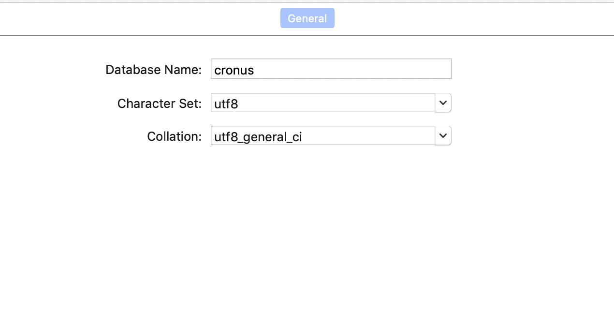

一个简易的API及UI自动化测试平台，代码分为前端和后端两部分。前端代码使用vue.js编写，后端代码使用Django编写。下面简要介绍一下，后端代码部分使用到的第三方库及版本，以及运行方式 

开发语言、第三方库及版本:  
Python: 3.6.11  
Django: 3.1  
celery: 4.4.7  
DjangoRestFramework: 3.11.1  
requests: 2.24.0   
selenium: 3.141.0  

数据存储:  
MYSQL: 8.0

消息中间件:  
redis  

将代码克隆到本地，到代码的目录下使用docker命令构建出需要的镜像(这里起名为cronus)
```
docker build -t cronus .
```
在运行cronus之前，请选确保MYSQL和Redis已经运行起来。MYSQL中创建好名为cronus的数据库，编码格式为UTF-8  


运行cronus 
```
docker run -d --name cronus -p 8081:8081 --env CELERY_BROKER_URL=redis://${address}:6379/0 --env DB_NAME=cronus --env DB_HOST=${address} --env FRONT_URL=${address}:8080 cronus
```
环境变量说明:  
CELERY_BROKER_URL: Redis的访问地址  
DB_NAME: 数据库名称  
DB_HOST: 数据库地址  
DB_PORT: 数据库访问端口  
DB_USER: 数据库用户名  
DB_PASSWORD: 数据库密码  
FRONT_URL: 前端访问地址  
EMAIL_HOST: SMTP服务器地址，忘记密码时，可以通过注册邮箱来重置密码  
EMAIL_PORT: SMTP端口  
EMAIL_HOST_USER:  SMTP用户名  
EMAIL_HOST_PASSWORD:  SMTP密码  
EMAIL_FROM: 用来配置发送邮件时的发送人   
SUPERUSER_NAME: 系统用户名，默认为：admin  
SUPERUSER_PASSWORD: 系统用户密码， 默认为： adminpwd  

根据自己的实际情况，在运行cronus时，使用上面的环境变量  


cronus运行起来后，使用docker命令exec进入cronus容器，执行以下命令来生成数据表结构和注册系统用户  
```
python manage.py makemigrations
python manage.py migrate
python register_app_create_superuser.py
```  

